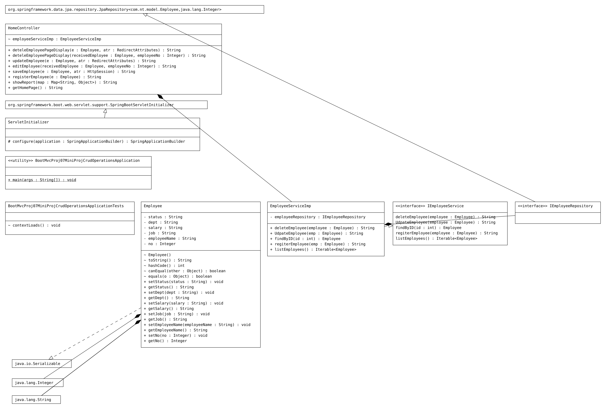
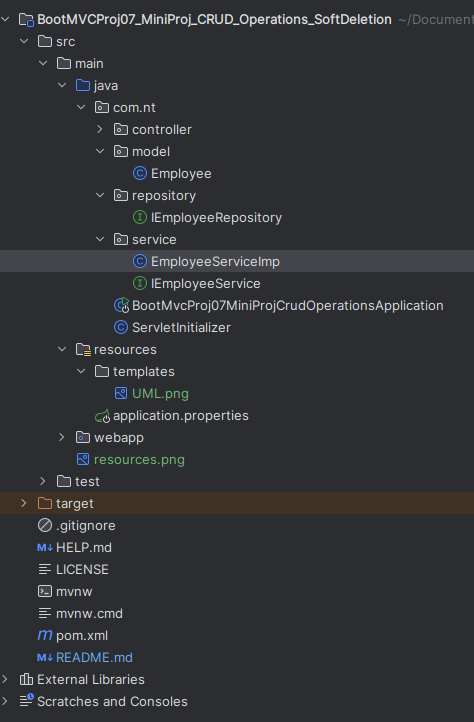

# BootMVCProj07_MiniProj_CRUD_Operations
BootMVCProj07_MiniProj_CRUD_Operations

## Source Code

# Model
```Java
package com.nt.model;

import java.io.Serializable;

import org.hibernate.annotations.SQLRestriction;
import org.hibernate.annotations.SQLDelete;

import jakarta.persistence.Entity;
import jakarta.persistence.GeneratedValue;
import jakarta.persistence.GenerationType;
import jakarta.persistence.Id;
import jakarta.persistence.SequenceGenerator;
import jakarta.persistence.Table;
import lombok.Data;

//TODO why data is not working, added getts and setts manaully
@Data
@Entity
@Table(name = "employee_new")
@SQLDelete(sql = "UPDATE employee_new set status = 'INACTIVE' WHERE no=?")
@SQLRestriction("status <> 'INACTIVE'")

public class Employee implements Serializable {

	@Id
	@SequenceGenerator(name = "gen1", sequenceName = "EMP_SEQ", initialValue = 5, allocationSize = 1)
	@GeneratedValue(generator = "gen1", strategy = GenerationType.SEQUENCE)
	private Integer no;

	

	public Integer getNo() {
		return no;
	}

	public void setNo(Integer no) {
		this.no = no;
	}

	public String getEmployeeName() {
		return employeeName;
	}

	public void setEmployeeName(String employeeName) {
		this.employeeName = employeeName;
	}

	public String getJob() {
		return job;
	}

	public void setJob(String job) {
		this.job = job;
	}

	public String getSalary() {
		return salary;
	}

	public void setSalary(String salary) {
		this.salary = salary;
	}

	public String getDept() {
		return dept;
	}

	public void setDept(String dept) {
		this.dept = dept;
	}

	private String employeeName;
	private String job;
	private String salary;
	private String dept;
	private String status;

	public String getStatus() {
		return status;
	}

	public void setStatus(String status) {
		this.status = status;
	}

	
}
```
# Repository
```Java
package com.nt.repository;

import org.springframework.data.jpa.repository.JpaRepository;

import com.nt.model.Employee;

public interface IEmployeeRepository extends JpaRepository<Employee, Integer> {

}
```
# Service
```Java
package com.nt.service;

import com.nt.model.Employee;

public interface IEmployeeService {

	public Iterable<Employee> listEmployees();

	public String regiterEmployee(Employee employee);
	
	public Employee findByID(int id);
	
	public String UdpateEmployee(Employee employee);
	
	public String deleteEmployee(Employee employee);

}
```
# Service Implementation 
```Java
package com.nt.service;

import java.util.List;
import java.util.Optional;

import org.springframework.beans.factory.annotation.Autowired;
import org.springframework.stereotype.Service;

import com.nt.model.Employee;
import com.nt.repository.IEmployeeRepository;

@Service
public class EmployeeServiceImp implements IEmployeeService {

	@Autowired
	private IEmployeeRepository employeeRepository;

	@Override
	public Iterable<Employee> listEmployees() {

		List<Employee> list = employeeRepository.findAll();
		System.out.println("EmployeeServiceImp.listEmployees()" + list);

		System.out.print("------------");

		for (Employee country : list) {
			System.out.println("Salary " + country.getSalary());
			System.out.println("Dept  " + country.getDept());
			System.out.println("Employee Name  " + country.getEmployeeName());
			System.out.println("Job  " + country.getJob());
		}

		System.out.print("------------");
		return list;
	}

	@Override
	public String regiterEmployee(Employee emp) {

		int value = employeeRepository.save(emp).getNo();
		return value + " is inserted into database";
	}

	@Override
	public Employee findByID(int id) {

		Employee employeeRecord = employeeRepository.findById(id).get();

		return employeeRecord;
	}

	@Override
	public String UdpateEmployee(Employee emp) {

		System.out.println("HomeController.updateEmployee()");

		Optional<Employee> empOptional = employeeRepository.findById(emp.getNo());

		if (empOptional.isPresent()) {
			employeeRepository.save(emp);
			return "Employee updated";

		}
		return "Employee NOT updated";

	}

	@Override
	public String deleteEmployee(Employee employee) {
		System.out.println("EmployeeServiceImp.deleteEmployee()");
		
		employeeRepository.deleteById(employee.getNo());
		
		return employee.getNo()+"";
	}

}
```
# Controller

# UML


# Project Structure

